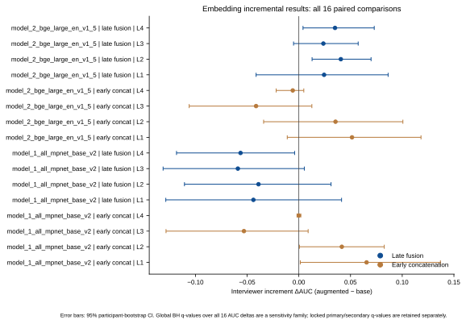
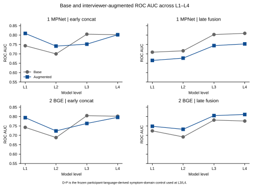

# 半结构化抑郁访谈中不同文本来源的 PHQ-8 预测信息：基于 DAIC-WOZ 的来源分解研究

**关键词：** 半结构化访谈；PHQ-8；文本来源；访谈者语言；概率校准；DAIC-WOZ

## 摘要

半结构化访谈的完整转录同时包含被试回答、访谈者提问及协议结构信息，因此其预测性能不能直接归因于被试自身语言。本研究基于 DAIC-WOZ 官方训练集和开发集中的 142 名被试，其中 PHQ-8 总分不低于 10 分者 43 名，将访谈文本分解为被试语言、访谈者语言、完整转录和临床导向症状证据表示，采用受试者级五折交叉验证比较不同来源的 PHQ-8 标签预测表现，并通过联合建模、结构变量控制、等文本预算分析及概率校准检验这些结果的可解释范围。被试语言、访谈者语言、完整转录和症状证据表示的 ROC AUC 分别为 0.717、0.808、0.760 和 0.735。访谈者语言相较被试语言的 AUC 差值区间跨过零；在保留被试语言、症状域信息和协议模板的基础上加入访谈者语言，AUC 仅增加 0.0028，未显示稳定的条件增量。协议结构和综合结构变量本身也具有一定预测信息。在双方采用相同文本预算后，来源差异的联合区间仍跨过零，且结果随文本窗口位置变化。被试语言具有排序能力，但原始概率校准较差，折内校准后有所改善。结果表明，半结构化访谈中的 PHQ-8 预测信息来自多种相互关联的文本和过程来源，单一来源的预测表现不能直接解释为独立贡献。完整转录性能的解释应同时考虑访谈协议、文本预算和概率校准；现有结果不能证明访谈者偏差、标签泄漏或临床可用性。

## 引言

文本访谈已被广泛用于抑郁症状风险的自动化预测。DAIC-WOZ 等半结构化访谈数据的一个重要特点是，完整转录并不只是被试的回答，还包括访谈者的提问、协议路径以及由互动形成的追问和反馈。因而，模型在完整转录上的表现反映的是一组共同出现的语言与过程信息，而不是一个单独的“患者语言”通道 [1,2]。

当完整转录模型取得较好性能时，研究者容易将结果解释为模型识别了被试的症状表达。然而，访谈者的提问内容、问题覆盖、协议分支和访谈长度也可能与标签相关；被试的回答还会反过来影响访谈者的追问方式。已有研究开始讨论访谈提示和互动信息在抑郁预测中的作用，但仅比较完整转录或报告单一来源的 AUC，仍不足以区分来源本身的预测信息与来源在其他信息之外的独立贡献 [3–9]。

这里需要区分两个层次的问题。某一来源单独能够预测，说明该来源具有预测充分性；这并不说明它在保留其他来源后仍然具有稳定的条件增量。来源比较还可能受到文本数量、信息在文本中的分布、协议结构和窗口位置的影响。因此，单一来源的高 AUC 不能直接转化为因果偏差、标签泄漏或某一说话者“更重要”的判断；概率校准和固定阈值表现也不能由排序指标代替。

本研究基于 DAIC-WOZ，将完整转录分解为被试语言、访谈者语言、完整转录和临床导向症状证据表示，比较不同来源的预测表现，并通过联合建模、结构变量控制和等文本预算分析，检验访谈者侧信息是否具有稳定的条件增量。进一步地，我们评估预测概率的校准和阈值表现，以明确排序性能、概率质量和二元决策之间的区别，并把症状证据的来源对齐修订限定在最终保留片段之内。

## 方法

#### 数据与结局

分析使用 DAIC-WOZ 官方训练集和开发集中具有完整标签与冻结来源输入的 142 名被试，其中 PHQ-8 总分不低于 10 分者 43 名。PHQ-8 是自评症状风险指标，不是临床诊断；本文的二元标签表示队列内的症状风险分类，而不是治疗决策或真实世界筛查结局。官方测试集标签不可用，因此核心分析不包含独立外部测试集。E-DAIC 的小样本描述性结果放在补充材料中，不承担泛化或复制验证的作用。

#### 文本来源与变量构建

主要输入包括被试语言、访谈者语言、完整转录和临床导向症状证据表示。症状证据表示由被试原话经过临床域筛选、信息压缩和人工来源对齐形成，是一种可追溯的衍生表示，不与被试原始语言视为对等的自然来源。结构变量按照文本长度、互动结构和协议结构归纳；完整的词数、话轮数、问题覆盖和提示统计表放在补充材料。

来源比较首先使用各自的原始文本。原等量控制把较长来源限制到较短来源的长度，因此两侧受到的扰动不对称，只作为补充分析。主要敏感性分析对每名被试定义共同预算

本研究的十个症状域计数来自最终保留的审核后症状证据片段，且每条计数证据均可在被试语言中匹配。因此，本文将该控制明确记为 **D-P（参与者语言衍生的症状域）**。本轮没有可通过来源和质量核查的全访谈 D-All 输入；现有结果不能被解释为在完整访谈症状域控制后的结果。

\[
L_i=\left\lfloor 0.5\times\min(L_{participant,i},L_{interviewer,i})\right\rfloor,
\]

并对两种来源使用相同的被试集合、相同的窗口抽样编号和预先固定的随机种子。每个窗口完成一次完整的受试者级五折交叉验证，在同一被试和同一窗口内配对来源差值；区间同时纳入被试重采样和窗口随机性。共同预算为零时保留该被试并令两侧文本均为空；目标长度小于 10 的人数单独报告。前段、中段和后段使用同一预算，分别取起始、中心和结束位置，不为任一来源选择有利窗口。

#### 模型与评价

各文本来源采用折内 TF-IDF 和逻辑回归建模，文本表示、数值标准化和参数拟合均只在训练折完成。主分析使用固定的受试者级五折划分，每名被试获得一次交叉拟合预测；重复交叉验证仅用于补充稳定性分析，不把重复折视为新增独立样本。结构模型只使用长度、互动或协议变量；联合模型先保留被试语言、D-P 症状域计数和协议模板，再分别加入访谈者语言或症状证据表示，以估计条件增量。

正文报告 ROC AUC、PR-AUC、Brier 分数、灵敏度、特异度和 Macro-F1。正式无技能 Brier 基线由每个外层测试折对应的外层训练折阳性率产生；全队列的阳性比例只作描述性基线。Brier skill score 定义为

\[
\mathrm{BSS}=1-\frac{\mathrm{Brier}_{model}}{\mathrm{Brier}_{null}}.
\]

Raw、Platt 和 isotonic 使用同一批外层交叉拟合预测比较，校准器不在汇总后的 OOF 预测上重新拟合。阈值在训练数据内部选择，固定 0.50 仅表示默认概率操作点，不是临床诊断界值。由于样本量有限，不把 isotonic 宣称为最优，而把其折间波动作为稳定性信息。

#### 比较与敏感性分析

比较分为两类。第一类比较不同来源的单独预测表现，回答某一来源是否含有标签相关信息；第二类在基础联合模型上加入访谈者语言或症状证据表示，回答这些表示在当前信息集合之外是否具有可检测的条件增量。结构模型、原等量控制、对称等文本预算和确定性位置窗口用于评估来源差异是否可能受非语义因素影响。

AUC 和差值区间以被试为重采样单位进行 5,000 次 bootstrap；配对置换使用被试内成对交换，主要比较采用 10,000 次置换并在预定的比较族内进行 Benjamini–Hochberg 校正。窗口敏感性和保留片段来源对齐敏感性分别报告其区间和校正后的比较结果。详细随机种子、每个窗口的结果、模型参数和哈希清单均放在补充材料与结果完整性文件中。

症状证据的来源对齐分析只比较同一批最终保留片段的原始模型文本和人工逐字对齐文本，保持片段纳入、来源顺序、症状域和极性不变。它不能恢复候选筛选阶段被排除的内容，也不能被命名为完整的人工审核前后比较。

## 结果

### 1 不同文本来源的预测表现

四类输入均含有 PHQ-8 标签相关的队列内排序信息。被试语言、访谈者语言、完整转录和症状证据表示的 ROC AUC 分别为 0.717（95% CI 0.614–0.811）、0.808（0.729–0.879）、0.760（0.670–0.844）和 0.735（0.640–0.819）。这些单来源结果说明各来源具有预测充分性，但不说明任何来源在其他信息之外具有独立贡献。访谈者语言相较被试语言的点估计更高，但配对差值的区间跨过零。

| 输入来源 | ROC AUC | PR-AUC | Raw Brier |
|---|---:|---:|---:|
| 被试语言 | 0.717 | 0.651 | 0.231 |
| 访谈者语言 | 0.808 | 0.661 | 0.196 |
| 完整转录 | 0.760 | 0.574 | 0.217 |
| 症状证据表示 | 0.735 | 0.558 | 0.224 |

完整来源和联合增量的逐项结果见[来源增量主结果表](../embedding_incremental/embedding_incremental_main_results.md)；该表同时保留锁定的主要/次要 q 值，并另列全 16 个 AUC 差异的 BH 敏感性 q 值。

排序性能与概率质量并不等价。被试语言的原始 Brier 为 0.231，相对于外层训练折基率的 Brier skill score 为 −0.092；Platt 校准后 BSS 为 0.152。固定 0.50 操作点的灵敏度为 0.047，而完全折内选择阈值后的灵敏度为 0.488、特异度为 0.869。校准后概率尺度有所改善，但不把 isotonic 宣称为最优，因为其小样本折间波动较大。

**图 1｜半结构化访谈中的来源与过程信息。** 不同来源均可能携带与标签相关的预测信息；图中的耦合路径表示可能的共同生成过程，不表示本文识别了因果效应。

**图 2｜不同文本来源的交叉拟合 AUC。** 误差线为被试级 bootstrap 95% CI。单来源 AUC 衡量预测充分性，不衡量独立贡献。

### 2 访谈者语言的条件增量与结构信息

在基础联合模型中加入访谈者语言，AUC 仅增加 0.0028（95% CI −0.0040–0.0101）；加入症状证据表示的增量为 0.0035（−0.0038–0.0114）。两者都未显示稳定的条件增量。这里的症状域控制是 D-P，而不是全访谈 D-All；因此结果应理解为在参与者语言衍生症状域与协议变量条件下的残余增量，不能扩展为在完整访谈症状控制后仍然如此。访谈者语言本身的预测表现较高，不能因此推断访谈者语言在被试语言、D-P 和协议模板之外仍提供同等规模的独立信息。

在四个模型层级中，D-P 条件下的 L4 ΔAUC 为：MPNet early 0.0000（−0.0018 至 0.0019）、MPNet late −0.0564（−0.1183 至 −0.0041）、BGE early −0.0059（−0.0219 至 0.0048）和 BGE late 0.0350（0.0040 至 0.0729）。这些是表示与融合方式敏感的条件结果，不构成 D-All 或因果解释。全 16 项的置信区间森林图和 L1–L4 轨迹图分别见 `embedding_incremental_delta_forest` 与 `embedding_incremental_auc_trajectory`。

**图 5｜16 项增量比较的森林图。** 早期拼接列为探索性结果；晚期融合保留锁定的主要与次要 FDR 列，并另列全 16 项 BH 敏感性校正。

**图 6｜L1–L4 基础与增强 AUC 轨迹。** 这些轨迹使用 D-P 症状域控制，不能解释为 D-All 或因果效应。

结构变量也含有不同程度的预测信息。文本长度结构模型的 AUC 为 0.569，互动结构模型为 0.573，协议结构模型为 0.675，综合结构模型为 0.729；互动结构模型的不确定性区间跨过 0.5。协议结构和综合结构的结果提示，访谈过程本身可能携带标签相关信息，但观察性设计不能把这种关联解释为协议造成了偏差。

**图 3｜概率校准和阈值表现。** 固定 0.50 是默认概率操作点，不是临床诊断阈值；阈值曲线不能替代概率校准或外部验证。

### 3 文本预算、窗口位置与症状证据的敏感性

原等量控制明显不对称，因此不作为来源差异的主要证据。在双方均采用对称半最小预算后，访谈者语言减被试语言的平均 AUC 差为 0.1174；纳入被试和窗口随机性的联合 95% 区间为 −0.0691 至 0.2953，仍跨过零。固定窗口抽样的配对置换结果与该联合区间回答的是不同问题，不能用前者替代对窗口不确定性的描述。

窗口位置改变了来源比较的方向和大小。早段窗口的访谈者减被试差为 0.2638，中段为 −0.0244，后段为 0.0928；因此，来源差异不能脱离信息在文本中的位置来解释。该结果说明文本量仍是尚未排除的替代解释，而不是已经被控制完毕的因素。

症状证据表示的单来源 AUC 为 0.735，未明显优于被试原始语言，也未在联合模型中提供稳定增量。最终保留片段的来源对齐修订使 AUC 改变量为 −0.0042（95% CI −0.0148–0.0049），主要改善逐字追溯性，而未观察到明确的性能改变。其候选数、修订数、排除数和逐条追溯过程见补充材料。

**图 4｜结构变量与文本预算敏感性。** 结构模型和共同预算窗口用于区分来源差异、过程结构和信息分布的可能作用；它们不提供因果机制识别。

## 讨论

本研究的核心结果是，完整转录中的预测信息并非全部来自被试语言。访谈者语言、协议结构和综合过程变量也含有标签相关信息，但在保留被试语言、D-P 症状域和协议模板后，访谈者语言的条件增量有限。由于 D-All 尚未形成可审计输入，这一结果不能写成“控制了完整访谈中的全部症状域信息”。由此，单来源 AUC 应被理解为预测充分性，而不是独立贡献或机制证据。

访谈者语言为什么具有预测力，存在多个相互兼容的解释。协议分支、合理追问、主题覆盖以及被试回答驱动的互动变化，都可能使访谈者文本与症状标签相关。当前数据是观察性的，无法区分这些生成过程，也不能把来源相关预测信号直接命名为访谈者偏差或标签泄漏。更稳妥的解释是，访谈者侧文本包含与访谈过程共同形成的可预测信息。

对称文本预算和窗口位置敏感性进一步限制了来源比较的解释。共同预算下的联合区间跨过零，且早、中、后段的差异方向不同，说明文本数量、信息分布和协议位置可能共同参与结果形成。因而，来源差异不能被简化为“语义来源”与“文本量”之间的单一二分，也不能据当前结果宣称文本量已经被充分控制。

校准和症状证据分析提供了两个方法学边界。AUC 反映排序能力，不直接反映概率可靠性或固定阈值下的决策质量；训练折基率构成的 Brier 基线和折内校准因此不可省略。症状证据表示有助于把预测线索组织为可追溯片段，但来源对齐修订主要改变逐字追溯性，不能据此声称模型获得了独立的病理理解。PHQ-8 是自评症状风险指标，不是临床诊断。

本研究仍受样本量较小、同一数据集内部交叉验证、观察性设计、有限的文本预算控制、D-P 与完整访谈症状内容之间的来源边界、来源对齐复核未能证明结果盲法且没有双人一致性、缺乏独立外部验证等限制。公开仓库可以验证代码、测试、合成样例、冻结派生结果和哈希，但在受限原始数据与私有审核源不可公开的前提下，不能宣称从原始数据完整复现全部分析。因此，完整转录模型的性能不应未经来源分解便归因于被试自身症状语言。半结构化访谈模型的解释应同时考虑说话者来源、协议结构、文本预算和概率校准，而不能仅依据单一 AUC 作出偏差、泄漏或临床有效性的判断。

## 数据与代码可用性

代码、单元测试、合成 fixture、参数与 schema 检查、冻结派生结果和 SHA-256 清单随公开仓库提供。公共 CI 验证代码/测试可运行性和结果完整性；DAIC-WOZ 受限原始数据以及含私有审核源的逐字证据不随仓库发布。完整数据到结果的复算需要获得相应受限输入。

## 伦理声明

本文使用既有去标识化访谈语料及其研究标签进行二次分析，不新增受试者干预或数据采集。PHQ-8 标签仅用于研究中的队列内症状风险分类，不用于个体诊断或治疗建议。

## 补充材料与统计说明

补充材料提供完整 ID 与固定划分、每次重复交叉验证结果、模型配置和随机种子、全部结构变量、50 个窗口的逐次结果、Brier/BSS/ECE/校准截距与斜率、阈值曲线、哈希和 CI 完整性清单，以及定向文献检索日志。原等量控制中，被试语言和访谈者语言分别有 132 人和 10 人被截断；该不对称性是采用对称半最小预算的原因之一。

症状证据候选共 1143 条，最终保留 1137 条，其中 1102 条无需来源修订，35 条进行了逐字来源对齐，5 条重复证据和 1 条无效证据被排除。最终保留片段的 1137/1137 追溯率是审核后的可追溯性，不是抽取准确率；35 条修订涉及 24 名被试，改变了 24 名被试的表示，空格分词总量增加 103。D-P 审计显示 1137 条保留片段均可在参与者语言中匹配，当前 D-All 状态为缺失，因此不能把 D-P 结果写成全访谈症状域控制。审核表包含 PHQ-8 分数或标签列，不能证明结果盲法；没有记录复核者身份或第二名独立复核者，无法报告双人一致性。

对称半最小预算的固定窗口配对置换检验使用同一被试交换向量贯穿 50 个窗口，得到 raw p=0.0039、BH q=0.0039；这一结果不替代纳入窗口随机性的联合区间。E-DAIC 仅提供 22 名被试的描述性边界结果，不用于外部验证、复制或泛化主张。

## 参考文献

1. Gratch J, Artstein R, Lucas GM, et al. The Distress Analysis Interview Corpus of human and computer interviews. *LREC 2014*. 2014:3123–3128. https://aclanthology.org/L14-1421/
2. Valstar M, Gratch J, Schuller B, et al. AVEC 2016: Depression, Mood, and Emotion Recognition Workshop and Challenge. *AVEC 2016*. 2016:3–10. doi:10.1145/2988257.2988258
3. López-Otero P, Docío-Fernández L, García-Mateo C. Depression Detection Using Automatic Transcriptions of De-Identified Speech. *Interspeech 2017*. 2017:3157–3161. doi:10.21437/Interspeech.2017-1201
4. Mallol-Ragolta A, Zhao Z, Stappen L, Cummins N, Schuller BW. A Hierarchical Attention Network-Based Approach for Depression Detection from Transcribed Clinical Interviews. *Interspeech 2019*. 2019:221–225. doi:10.21437/Interspeech.2019-2036
5. Rinaldi A, Fox Tree J, Chaturvedi S. Predicting Depression in Screening Interviews from Latent Categorization of Interview Prompts. *ACL 2020*. 2020:7–18. doi:10.18653/v1/2020.acl-main.2
6. Burdisso S, Reyes-Ramírez E, Villatoro-Tello E, et al. DAIC-WOZ: On the Validity of Using the Therapist's Prompts in Automatic Depression Detection from Clinical Interviews. *ClinicalNLP 2024*. 2024:82–90. doi:10.18653/v1/2024.clinicalnlp-1.8
7. Agarwal N, Milintsevich K, Metivier L, et al. Analyzing Symptom-based Depression Level Estimation through the Prism of Psychiatric Expertise. *LREC-COLING 2024*. 2024:974–983. https://aclanthology.org/2024.lrec-main.87/
8. Zhao X, Lyu Y, Wang D, Tang B. Predicting Depression in Screening Interviews from Interactive Multi-Theme Collaboration. *Findings of ACL 2025*. 2025:23025–23035. doi:10.18653/v1/2025.findings-acl.1181
9. Zhang E, Poellabauer C. Mitigating Interviewer Bias in Multimodal Depression Detection: An Approach with Adversarial Learning and Contextual Positional Encoding. *Findings of EMNLP 2025*. 2025:12169–12188. doi:10.18653/v1/2025.findings-emnlp.650
10. Lee JJ, Han J, Woo CW. Interpretable depression assessment using a large language model. *PLOS Digit Health*. 2026;5(2):e0001205. doi:10.1371/journal.pdig.0001205
11. Schmidt F, Ravan S, Vlassov V. Probabilistic Depression Detection from Textual Time Series. *Findings of ACL 2026*. 2026:32574–32589. doi:10.18653/v1/2026.findings-acl.1630
12. Kroenke K, Strine TW, Spitzer RL, Williams JBW, Berry JT, Mokdad AH. The PHQ-8 as a measure of current depression in the general population. *J Affect Disord*. 2009;114(1–3):163–173. doi:10.1016/j.jad.2008.06.026
13. Benjamini Y, Hochberg Y. Controlling the false discovery rate: a practical and powerful approach to multiple testing. *J R Stat Soc Series B*. 1995;57(1):289–300. doi:10.1111/j.2517-6161.1995.tb02031.x
