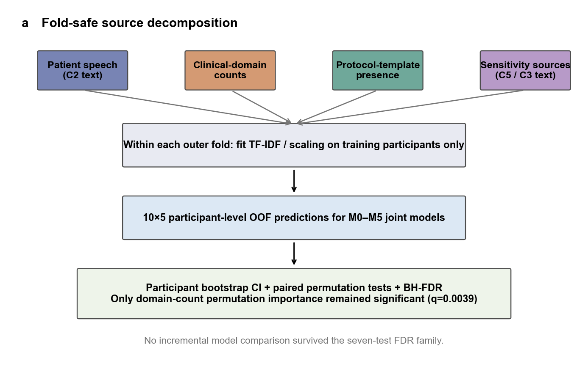
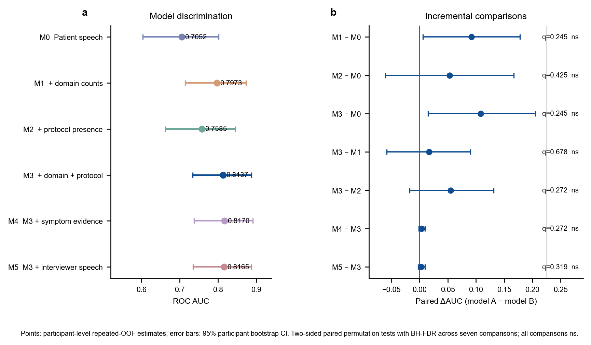
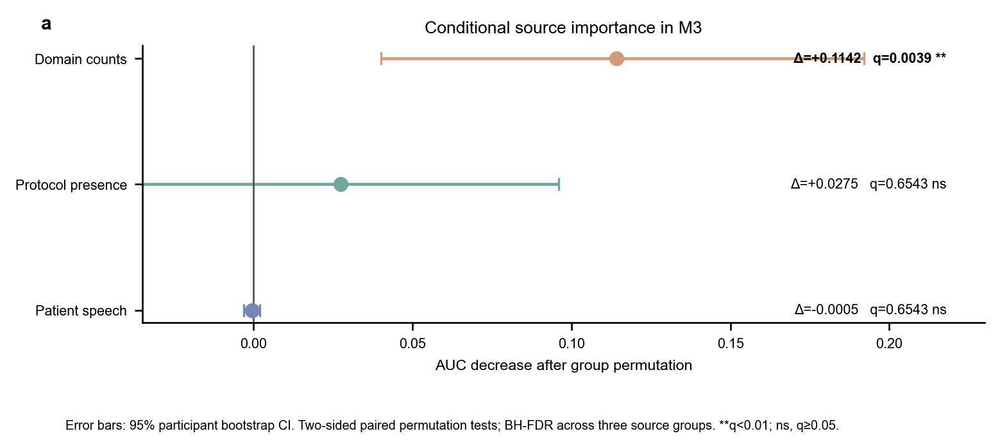
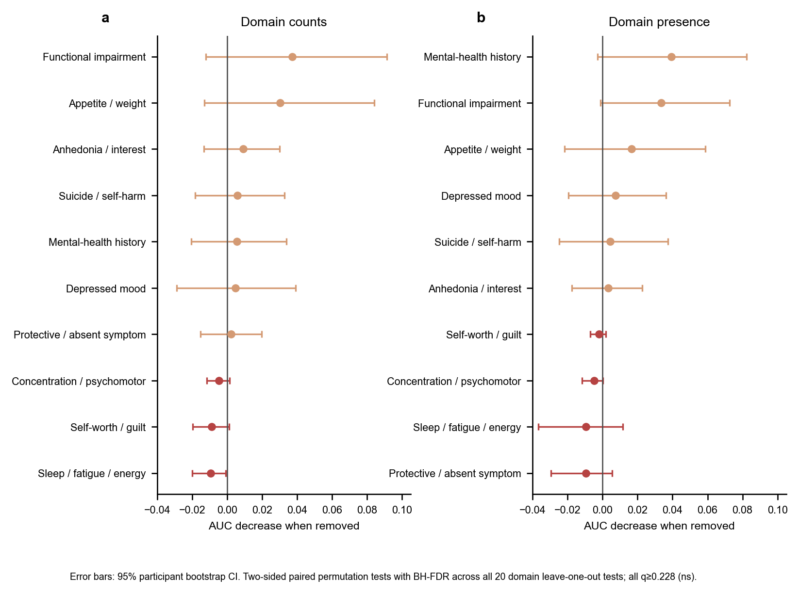

# 半结构化访谈中的抑郁预测信号来自何处？DAIC-WOZ PHQ-8 阳性分类的无泄漏来源分解

> **稿件类型：** 方法学重分析  
> **分析版本：** reanalysis v2 strict joint models  
> **冻结队列：** DAIC-WOZ 官方训练集与开发集，共 142 人（PHQ-8 阳性 43 人，阴性 99 人）  
> **推断框架：** 10 × 5 受试者级重复分层交叉验证；5000 次受试者级自助法；10,000 次双侧配对置换；预设检验族内 Benjamini–Hochberg FDR 校正  
> **更新日期：** 2026-07-05

---

## 摘要

**背景：** DAIC-WOZ 被广泛用于自动抑郁识别，但半结构化访谈同时包含来访者回答、访谈者提问、临床主题覆盖与协议路径。若不拆分这些来源，完整转录文本上的预测性能可能被误解为模型对来访者症状语言的直接识别。

**方法：** 本研究在冻结的 142 人官方训练集与开发集队列上预测 PHQ-8 阳性（阈值为 10）。我们构建六个直接使用原始来源特征的联合模型：来访者文本基线（M0），分别加入临床域计数（M1）或访谈模板出现特征（M2），同时加入两类结构化特征（M3），再分别加入症状证据文本（M4）或访谈者文本（M5）。所有文本 TF–IDF 变换、数值标准化与分类器拟合均仅在每个外层训练折内完成，避免先聚合 OOF 预测再进入第二层交叉验证造成的跨层信息混淆。模型采用 10 × 5 受试者级重复分层交叉验证。AUC 及其差值的区间由 5000 次受试者级自助抽样估计，差异检验采用 10,000 次双侧配对置换，并在 7 个增量比较、3 个来源置换重要性比较和 20 个临床域逐项剔除比较三个预设检验族内分别进行 Benjamini–Hochberg 校正。

**结果：** M0 的 AUC 为 0.7052（95% CI 0.6035–0.8016），M3 的 AUC 为 0.8137（0.7341–0.8880）。M3 相对 M0 的描述性增量为 0.1085（0.0147–0.2055），但经多重比较校正后不显著（置换 *p* = 0.0405，*q* = 0.2450）。全部 7 个预设模型增量比较均未通过 FDR 校正。M3 的组置换分析中，仅临床域计数的重要性达到校正后显著（AUC 下降 0.1142，0.0401–0.1920，*q* = 0.0039，**）；模板出现特征（*q* = 0.6543）和来访者文本（*q* = 0.6543）均不显著。20 个临床域逐项剔除比较均未通过 FDR 校正（最小 *q* = 0.2280）。在 M3 上继续加入症状证据文本或访谈者文本只产生很小且不显著的 AUC 增量。

**结论：** 严格重分析支持两个边界明确的判断：来访者文本具有可重复的基线判别信号；在当前 M3 表征与模型条件下，临床域计数具有显著的条件性重要性。现有结果不足以宣称协议模板、任一单独临床域或任一增量模型比较在 FDR 控制后显著。DAIC-WOZ 完整访谈上的高性能不宜直接等同于对来访者抑郁症状语言的理解。

**关键词：** DAIC-WOZ；PHQ-8；自动抑郁识别；访谈者偏倚；数据泄露；重复交叉验证；置换重要性；多重比较

---

## 1 引言

自动抑郁识别研究常从心理访谈的文本、语音或视觉信息预测量表分数或二分类标签。DAIC-WOZ 提供由虚拟访谈者 Ellie 主持的半结构化访谈，并因 AVEC 挑战而成为常用基准数据集之一[1,2]。然而，这类访谈不是仅由来访者自由表达构成的中性文本：访谈者按照协议提出问题，来访者的前序回答可能改变后续主题路径，某些心理健康史、功能损害或自伤相关模块也可能只在特定情境下出现。

因此，完整转录文本中的标签相关信号至少可能来自四个相互耦合的部分：来访者的语言表达、访谈者的词汇内容、临床主题是否及多少次被覆盖，以及访谈协议进入了哪些模板化路径。Burdisso 等对 DAIC-WOZ 的研究显示，访谈者提示语可能形成与标签相关的判别捷径，尤其集中于既往心理健康经历相关区域[3]。这一发现提示，较高的预测性能不必然意味着模型学习了可泛化的来访者症状语言。

本研究不追求新的最优性能，而是回答三个更窄的问题：第一，单独使用来访者文本时是否存在基线判别信号；第二，在同一无泄漏交叉验证管线中加入临床域计数或访谈模板出现特征，是否带来经多重比较校正后仍成立的增量；第三，在联合模型内打乱某一来源，以及在结构化域模型中逐项删除某一临床域时，哪些条件性贡献能够经受受试者级推断和 FDR 校正。

此前版本曾把受试者层面聚合后的基础模型 OOF 概率作为第二层交叉验证特征，并以重复折为独立单位估计不确定性。这可能造成跨层堆叠泄露风险与伪重复。本文以直接、折内拟合的原始来源特征联合建模，所有推断均以受试者为重采样或配对单位，替代旧分析并重新界定可支持的结论。

## 2 方法

### 2.1 数据集、队列与结局

分析使用 DAIC-WOZ 官方训练集与开发集中拥有完整 PHQ-8 标签和预定义来源表的 142 名受试者，队列在分析前冻结。其中 PHQ-8 阳性 43 人、阴性 99 人；二分类阈值为 PHQ-8 ≥ 10，该阈值与 PHQ-8 的常用筛查界值一致[4]。官方测试集标签不可用，因此本研究没有外部独立测试集，所有性能均为冻结队列内的重复 OOF 估计。

### 2.2 输入来源

预定义输入分为五组：

1. **来访者文本（C2）**：每名受试者全部来访者话轮拼接后的原始文本。
2. **临床域计数**：从经复核的症状证据中得到的 10 个预设临床域计数，包括抑郁心境、兴趣减退、睡眠/疲劳/精力、食欲/体重、自我价值/内疚、注意/精神运动、自杀/自伤、功能损害、心理健康史及保护性或症状缺失证据。
3. **访谈模板出现特征**：预设访谈模板是否在该访谈中出现的二元结构特征。
4. **症状证据文本（C5）**：仅保留受试者原话证据、经人工复核的症状相关文本。
5. **访谈者文本（C3）**：每名受试者全部访谈者话轮拼接后的原始文本。

临床域与模板特征是从访谈中操作化得到的表征，不是外生临床变量，也不是因果机制指标。其统计作用只能解释为当前特征定义、当前数据集和当前模型下的条件性关联。

### 2.3 无泄漏联合模型

六个模型在每个外层训练折内直接组合原始特征，不使用先前模型在同一受试者上的聚合预测作为二级输入。

**表 1｜预设来源模型**

| 模型 | 折内输入 | 预设比较目的 |
|---|---|---|
| M0 | 来访者文本 | 估计来访者原始语言的基线信号 |
| M1 | M0 + 临床域计数 | 检验临床域计数的增量 |
| M2 | M0 + 访谈模板出现 | 检验协议结构表征的增量 |
| M3 | M0 + 临床域计数 + 访谈模板出现 | 检验两类结构化来源的联合增量 |
| M4 | M3 + 症状证据文本 | 检验证据文本在结构化来源之外的增量 |
| M5 | M3 + 访谈者文本 | 检验访谈者词汇在模板结构之外的增量 |

文本采用词级 1–2 gram TF–IDF，`min_df = 2`、最多 50,000 个特征并使用次线性 TF；各文本来源分别拟合向量器。数值特征在训练折内标准化。分类器为 L2 逻辑回归（`C = 1.0`、`class_weight = balanced`、`liblinear`、最多 2000 次迭代）。所有向量器、标准化器与分类器只访问对应外层训练受试者，随后用于该折测试受试者。

**图 1｜无泄漏来源分解与推断框架。** 原始文本和结构化来源在每个训练折内独立拟合预处理器，生成 10 × 5 受试者级 OOF 预测；随后以受试者为单位进行自助法区间估计、双侧配对置换和检验族内 BH-FDR 校正。图中星号仅标记校正后显著结果。用于投稿的同名 SVG、PDF 与 600 dpi TIFF 文件位于 `figures/` 目录。

### 2.4 交叉验证与性能指标

所有模型共享预先冻结的 10 次重复、每次 5 折的受试者级分层划分。每名受试者在每次重复中恰好进入一个测试折，最终将其 10 个 OOF 概率取均值，得到一个受试者级预测。主要指标为 ROC AUC；同时报告 PR AUC、Brier 分数与对数损失。较低的 Brier 分数和对数损失表示更好的概率预测质量。

### 2.5 统计推断与显著性标记

模型 AUC 与配对 ΔAUC 的 95% 区间采用 5000 次受试者级有放回抽样。模型差异的双侧 *p* 值通过在每名受试者内随机交换两模型预测、共 10,000 次置换得到。预设三个检验族并分别使用 Benjamini–Hochberg 方法控制 FDR[5]：7 个增量模型比较、3 个 M3 来源组置换比较、20 个临床域逐项剔除比较。

显著性标记统一为：`ns`，*q* ≥ 0.05；`*`，*q* < 0.05；`**`，*q* < 0.01；`***`，*q* < 0.001。主要显著性判断以配对置换检验经 FDR 校正后的 *q* 值为准；自助法区间用于描述效应大小的不确定性。由于两者的重采样机制与零假设不同，个别比较可能出现 95% 区间不跨 0、但 FDR 校正后不显著的情况。

### 2.6 条件置换重要性与临床域逐项剔除

在每个外层测试折内，对 M3 的来访者文本、临床域计数和模板出现特征分别进行 100 次组内置换；其余来源及已拟合模型保持不变。将原始与置换后的 OOF 概率聚合到受试者层面，以 AUC 下降表示该来源在 M3 中的条件性重要性。

临床域逐项剔除是单独的结构化特征分析。对“域是否出现”和“域出现次数”两种 10 维表征分别拟合全模型，然后每次删除一个域并重跑同一 10 × 5 折内管线。20 个结果构成一个 FDR 检验族。该分析不等同于因果消融，也不能证明某临床域是标签形成原因。

## 3 结果

### 3.1 联合模型性能

所有模型的受试者级重复 OOF 结果见表 2。来访者文本基线 M0 的 AUC 为 0.7052（95% CI 0.6035–0.8016）。加入临床域计数后的 M1 为 0.7973（0.7146–0.8736），加入模板出现后的 M2 为 0.7585（0.6625–0.8458），联合模型 M3 为 0.8137（0.7341–0.8880）。M4 和 M5 的 AUC 分别为 0.8170 与 0.8165，与 M3 接近。

**表 2｜六个无泄漏联合模型的受试者级重复 OOF 性能**

| 模型 | ROC AUC（95% CI） | PR AUC | Brier | 对数损失 |
|---|---:|---:|---:|---:|
| M0 | 0.7052（0.6035–0.8016） | 0.5946 | 0.2316 | 0.6563 |
| M1 | 0.7973（0.7146–0.8736） | 0.6672 | 0.1693 | 0.5225 |
| M2 | 0.7585（0.6625–0.8458） | 0.5706 | 0.1802 | 0.5743 |
| M3 | 0.8137（0.7341–0.8880） | 0.6999 | 0.1664 | 0.5313 |
| M4 | 0.8170（0.7376–0.8912） | 0.7025 | 0.1642 | 0.5222 |
| M5 | 0.8165（0.7350–0.8875） | 0.7020 | 0.1652 | 0.5249 |

**图 2｜模型判别性能与预设增量比较。** a，各模型受试者级重复 OOF AUC 及 95% 受试者级自助法区间。b，配对 ΔAUC 及 95% 区间；右侧为 7 个比较检验族内 BH-FDR 校正后的 *q* 值。全部比较均为 `ns`。同名 SVG、PDF 与 600 dpi TIFF 为投稿版本。

### 3.2 增量比较均未通过 FDR 校正

虽然 M1−M0 与 M3−M0 的自助法区间下界高于 0，但主要推断依据是配对置换检验及预设检验族内的 FDR 校正。7 个增量比较均未通过 FDR 校正（表 3）。其中，M3−M0 的 ΔAUC 为 0.1085（95% CI 0.0147–0.2055），原始 *p* = 0.0405，但 *q* = 0.2450；因此不能表述为“显著提高”。M4−M3 与 M5−M3 的点估计分别只有 0.0033 和 0.0028，也不支持额外来源带来稳定增量。

**表 3｜预设配对 AUC 增量比较**

| 比较 | ΔAUC（95% CI） | 置换 *p* | BH-FDR *q* | 标记 |
|---|---:|---:|---:|:---:|
| M1 − M0 | 0.0921（0.0057–0.1781） | 0.0700 | 0.2450 | ns |
| M2 − M0 | 0.0533（−0.0607–0.1671） | 0.3647 | 0.4254 | ns |
| M3 − M0 | 0.1085（0.0147–0.2055） | 0.0405 | 0.2450 | ns |
| M3 − M1 | 0.0164（−0.0587–0.0903） | 0.6781 | 0.6781 | ns |
| M3 − M2 | 0.0552（−0.0179–0.1312） | 0.1341 | 0.2721 | ns |
| M4 − M3 | 0.0033（−0.0017–0.0094） | 0.1555 | 0.2721 | ns |
| M5 − M3 | 0.0028（−0.0027–0.0092） | 0.2279 | 0.3190 | ns |

### 3.3 M3 中仅临床域计数具有校正后显著的条件置换重要性

M3 的来源组置换结果见图 3。置换临床域计数后，AUC 下降 0.1142（95% CI 0.0401–0.1920，*p* = 0.0013，*q* = 0.0039，**），是三个来源中唯一经 FDR 校正后显著的结果。模板出现特征的 AUC 下降为 0.0275（−0.0411–0.0961，*q* = 0.6543，ns）；来访者文本的估计为 −0.0005（−0.0032–0.0020，*q* = 0.6543，ns）。后两项不能据此解释为“无信息”，因为组间相关、正则化与替代特征可能使条件置换重要性接近零；它们仅表示在当前 M3 的其他来源已保留时，没有检测到独立的置换损失。

**图 3｜M3 的来源组条件置换重要性。** 横轴为打乱一个来源后相对原模型的 AUC 下降，误差线为 95% 受试者级自助法区间。三项比较在同一检验族内进行 BH-FDR 校正；仅临床域计数达到 `**`（*q* = 0.0039），其余为 `ns`。

### 3.4 单个临床域结果均为探索性

仅使用临床域计数的完整结构化模型 AUC 为 0.7938，仅使用临床域出现特征的完整模型 AUC 为 0.7905。描述性点估计中，删除功能损害计数（ΔAUC = 0.0374）或食欲/体重计数（0.0303）后下降较大；在出现特征中，心理健康史（0.0392）和功能损害（0.0336）点估计较大。然而，20 个逐项剔除比较均未通过 FDR 校正，最小 *q* = 0.2280。因此，图 4 只能用于生成后续验证假设，不能把任何单一临床域标记为统计显著或“最关键域”。

**图 4｜临床域逐项剔除的描述性结果。** a，域计数表征；b，域是否出现表征。点为删除该域后全模型相对简化模型的 AUC 差值，误差线为 95% 受试者级自助法区间。20 个比较作为一个检验族进行 BH-FDR 校正，全部为 `ns`。

## 4 讨论

本研究最稳健的结果不是“结构化来源显著提高了所有模型”，而是更受限的两点。第一，M0 的 AUC 为 0.7052，说明来访者文本在冻结队列内含有基线判别信号。第二，在包含来访者文本、临床域计数和模板出现特征的 M3 中，只有临床域计数的组置换重要性经 FDR 校正后显著。这说明当前临床域计数表征在联合模型中携带了不可由其余两组完全替代的条件性预测信息。

这些结果同时收窄了旧版本的结论。M3 相对 M0 的点估计较高，且自助法区间不跨 0，但其 7 项比较检验族内 *q* = 0.2450。因而，本文不能声称“临床域与协议结构使 AUC 显著提高”。模板出现特征的条件置换重要性也不显著，所以不能把“访谈协议结构”与临床域计数并列称为已证实的主要来源。严格表述应当区分：模型性能的描述性排序、效应大小区间，以及经预设多重比较控制后的显著性结论。

M4 与 M5 几乎没有超过 M3。症状证据文本是从来访者原话中筛出的临床相关片段，其信息可能已被临床域计数压缩；访谈者文本则与模板出现特征共享访谈路径信息。两种解释都符合特征冗余，但当前结果不能区分“确实没有额外信息”与“额外信息被相关特征或线性模型吸收”。因此，应避免把不显著结果写成来源绝对无效。

来源分解也改变了对访谈者偏倚的理解。既往研究指出，访谈者提示语可能使模型利用与心理健康史相关的访谈区域作为捷径[3]。本研究在更细的来源拆分下发现，临床域计数具有显著的条件性重要性，而模板出现和访谈者原文的额外贡献未通过 FDR 校正。这与“访谈路径相关信息值得警惕”相容，但不足以证明具体偏倚机制，更不能将条件性预测关联解释为因果作用。

从方法学上看，最关键的修正是取消“聚合 OOF 概率再进入第二层 CV”的建模方式。新的联合模型在每个外层训练折中同时拟合文本与结构化特征，测试受试者不参与词表、标准化或参数估计。统计推断也不再把 50 个重复折当作相互独立样本，而以 142 名受试者为配对和重采样单位。这使不确定性与研究对象的独立单位一致，并避免折级伪重复夸大精度。

## 5 局限

第一，样本量仅为 142 人，其中阳性 43 人；置信区间较宽，FDR 校正后的检验能力有限。不显著不能被解释为严格等价或无效应。

第二，本研究没有外部独立测试集。重复 OOF 结果反映冻结训练集与开发集内的泛化估计，不能直接外推到其他访谈协议、语言、临床机构或人群。

第三，自助法与置换检验基于固定的重复 OOF 预测，没有在每次重采样中从头重建全部交叉验证模型。因此，区间与 *p* 值主要刻画受试者抽样和配对预测差异，不完整包含重新训练造成的算法方差。它们适合本队列内的条件性比较，但不是完整的外部部署不确定性。

第四，临床域、模板出现和症状证据文本均由既定操作化流程产生，彼此并非统计独立。尤其是临床域计数源自症状证据，其较高重要性可能反映信息压缩、标注规则或与标签构念接近，而非真实临床机制。

第五，本研究使用词级 TF–IDF 与线性逻辑回归。不同的文本表征、正则化方式或非线性模型可能改变来源之间的信息分配。置换重要性也受共线性影响，不能形成唯一的来源排序。

第六，临床域逐项剔除同时涉及 20 个相关比较。尽管已进行 FDR 校正，当前样本仍不足以对单个域作确认性结论；相关点估计应在独立数据和预注册特征定义下复验。

## 6 结论

在严格、折内拟合的来源联合模型中，来访者文本显示中等的基线判别能力；临床域计数是 M3 中唯一具有 FDR 校正后显著条件置换重要性的来源（*q* = 0.0039，**）。与此同时，7 个模型增量比较、模板出现与来访者文本的条件置换重要性，以及 20 个单域逐项剔除比较均未达到校正后显著。

因此，DAIC-WOZ 上的预测结果应被表述为多种耦合来源下的条件性性能，而不能直接等同于模型理解了来访者的抑郁症状语言。未来工作应在独立队列中预注册来源定义和比较族，并将访谈者内容、访谈路径与来访者语言分开评估。

## 数据与代码可用性

本稿使用的冻结输入、预定义划分、严格重分析输出、图表生成脚本、运行环境与 SHA-256 清单均保存在本项目 `analysis_v2/` 目录。DAIC-WOZ 原始受限数据须依照数据提供方的申请与使用协议获取，不随本仓库重新分发。严格结果入口为 `analysis_v2/10_source_importance/07_strict_joint_models/`；可复现脚本快照位于 `analysis_v2/08_reproducibility_scripts/`。

## 伦理声明

本研究是对既有去标识化研究数据的二次分析。原始数据的伦理审批、知情同意与共享限制以 DAIC-WOZ 数据提供方文件为准。本文不作临床诊断用途声明，模型输出不得替代专业评估。

## 参考文献

1. Gratch J, Artstein R, Lucas GM, et al. The Distress Analysis Interview Corpus of human and computer interviews. *Proceedings of LREC 2014*. 2014:3123–3128. [ACL Anthology](https://aclanthology.org/L14-1421/)
2. Valstar M, Gratch J, Schuller B, et al. AVEC 2016: Depression, Mood, and Emotion Recognition Workshop and Challenge. *Proceedings of the 6th International Workshop on Audio/Visual Emotion Challenge*. 2016:3–10. doi:[10.1145/2988257.2988258](https://doi.org/10.1145/2988257.2988258)
3. Burdisso S, Reyes-Ramírez E, Villatoro-Tello E, Sánchez-Vega F, Lopez Monroy A, Motlicek P. DAIC-WOZ: On the validity of using the therapist's prompts in automatic depression detection from clinical interviews. *Proceedings of the 6th Clinical Natural Language Processing Workshop*. 2024:82–90. doi:[10.18653/v1/2024.clinicalnlp-1.8](https://doi.org/10.18653/v1/2024.clinicalnlp-1.8)
4. Kroenke K, Strine TW, Spitzer RL, Williams JBW, Berry JT, Mokdad AH. The PHQ-8 as a measure of current depression in the general population. *Journal of Affective Disorders*. 2009;114(1–3):163–173. doi:[10.1016/j.jad.2008.06.026](https://doi.org/10.1016/j.jad.2008.06.026)
5. Benjamini Y, Hochberg Y. Controlling the false discovery rate: a practical and powerful approach to multiple testing. *Journal of the Royal Statistical Society: Series B*. 1995;57(1):289–300. doi:[10.1111/j.2517-6161.1995.tb02031.x](https://doi.org/10.1111/j.2517-6161.1995.tb02031.x)
