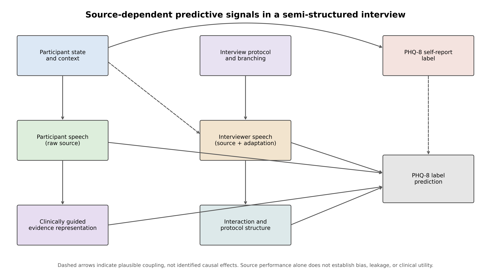
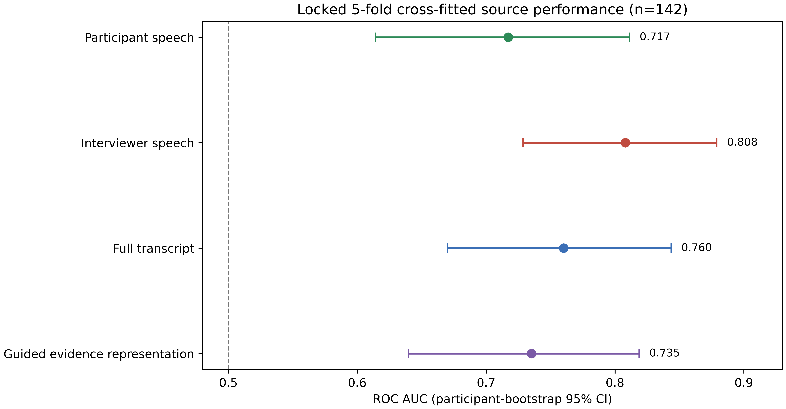
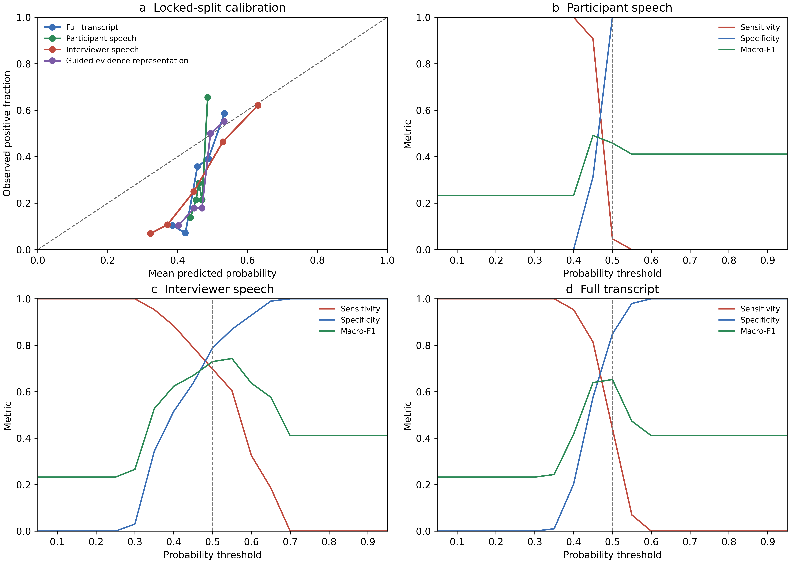
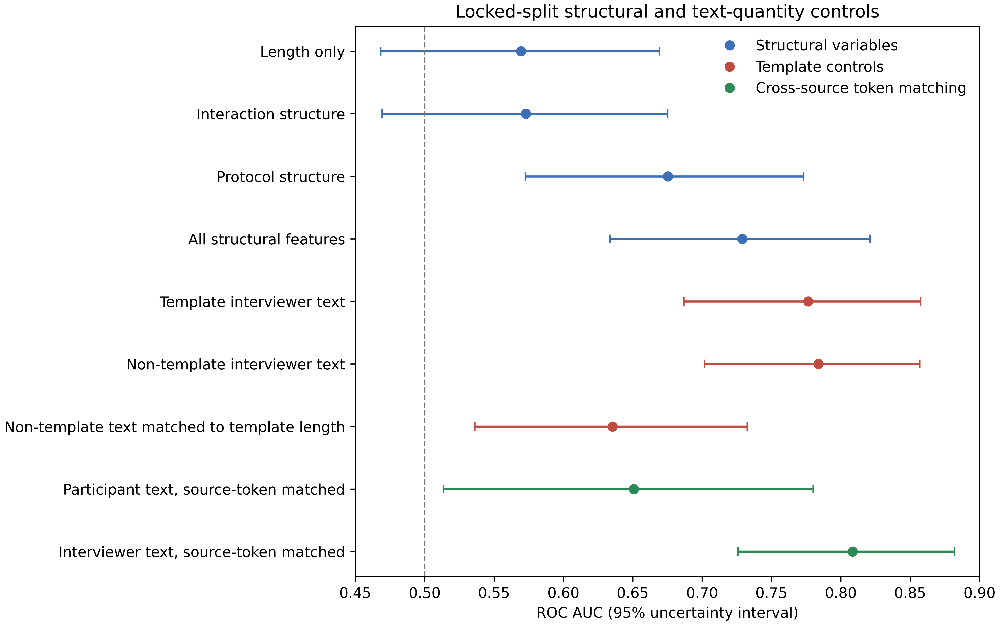

# 半结构化抑郁访谈中的来源相关预测信号审计：DAIC-WOZ PHQ-8 标签分析

**英文拟题：** Auditing Source-Dependent Predictive Signals in Semi-Structured Depression Interviews

> 唯一主张：本研究审计半结构化访谈中 PHQ-8 标签预测信号的来源，并检验完整转录性能能否被直接归因于被试自身语言。

> 解释边界：本文识别来源相关预测信息，不证明访谈者造成因果偏差或标签泄漏，也不评价临床诊断、真实世界筛查效益或部署价值。

## 摘要

**背景：** 半结构化访谈的完整转录同时包含被试回答、访谈者提问、协议分支、互动结构和后续加工得到的症状证据表示。若不区分这些来源，完整转录模型的性能可能被直接归因于被试症状语言。

**目的：** 审计不同来源能否单独提供 PHQ-8 标签预测信息，检验访谈者与衍生证据表示对联合模型是否提供可检测的条件增量，并评估协议结构、文本量、校准与决策阈值对结果解释的影响。

**方法：** 分析纳入 DAIC-WOZ 官方训练集与开发集中的 142 名被试，其中 PHQ-8 总分不低于 10 分者 43 人。主分析采用在最终投稿审计前固定的第 1 组五折受试者级分析锁定划分，使每名被试仅产生一次 cross-fitted 预测；该锁定用于阻止继续按结果选择划分，不构成正式预注册。既有 10×5 重复交叉验证仅用于补充评估随机划分稳定性。比较完整转录、被试原始语言、访谈者语言、非显性临床访谈者语言和临床导向症状证据表示。控制分析包括纯结构变量模型、模板分解、原等量窗口，以及双方均截取至半数共同最短长度的对称窗口和前、中、后段敏感性。报告 ROC AUC、PR-AUC、Brier 分数、相对于外层训练折基率的 Brier skill score、校准截距/斜率、固定 0.50 操作点和完全嵌套于训练折的阈值结果。五个核心差异采用受试者级配对 bootstrap 与置换检验，并进行 Benjamini–Hochberg 校正。

**结果：** 分析锁定五折中，被试语言、访谈者语言、完整转录和症状证据表示的 AUC 分别为 0.717（95% CI 0.614–0.811）、0.808（0.729–0.879）、0.760（0.670–0.844）和 0.735（0.640–0.819）。访谈者与被试语言的 AUC 差为 0.0909（−0.0004 至 0.1898；原始 p=0.0876，q=0.4380），不能据点估计断言前者更优；访谈者语言加入联合基线后的条件增量为 0.0028（−0.0040 至 0.0101；p=0.3785，q=0.4731）。互动结构单独模型的区间跨 0.5；协议结构和全部结构变量模型的 AUC 分别为 0.675 和 0.729。原等量控制明显不对称：被试与访谈者文本分别有 132 人和 10 人被截断。对称半最小预算下，访谈者减被试的平均 ΔAUC 为 0.1174（固定 50 个 draw 的被试内置换 raw p=0.0039，BH q=0.0039），纳入受试者与窗口随机性的联合区间为 −0.0691–0.2953；由于该联合区间跨 0，本文不把固定 draw 的置换结果解释为全局来源差异。前、中、后段结果亦表现出位置敏感性，故现有证据不能排除信息预算和窗口位置的影响。正式无技能 Brier 基线由各外层训练折基率产生；被试语言原始 Brier skill score 为 −0.092（−0.105 至 −0.080），Platt 校准后为 0.152（0.047–0.249）。C5 的 1143 条候选中，1102 条可直接匹配来源，35 条仅作逐字来源对齐修订，6 条被排除；1137/1137 是审核后最终追溯率而非抽取准确率。保留片段的来源对齐修订敏感性分析显示 AUC 改变量为 −0.0042（−0.0148 至 0.0049）。

**结论：** DAIC-WOZ 中不同文本来源与过程结构均可能携带标签相关信息，但来源差异对信息预算和窗口位置敏感。来源单独可预测不等于其对联合模型具有独立贡献，更不等于因果偏差、标签泄漏或临床可用性。本文支持的是一套克制的来源审计框架，而不是“访谈者偏差已被证明”。

## 1 引言

### 1.1 问题与主张边界

DAIC-WOZ 等半结构化访谈数据常用于 PHQ-8 标签预测。完整转录模型的输入并非单一“患者语言”：访谈者按照预设协议提问，又会依据被试回答进入不同分支、追加澄清或给予反馈；访谈长度、话轮数量、问题覆盖和模板路径也随互动而变化。因此，完整转录上的判别性能只能说明混合输入含有标签相关信息，不能未经审计便解释为模型识别了被试自身症状语言。

访谈者侧文本具有预测力也有多种非互斥解释：合理追问、协议分支、访谈长度、被试反应驱动的调整、特定主题覆盖或数据采集流程。本文统一使用“来源相关预测信号”“协议相关信号”或“互动结构信号”。除引用既往作者原有术语外，不把观察到的关联直接称为 interviewer bias、leakage、contamination、spurious signal 或 inflated performance。

本文区分三种证据层级：单来源模型回答“该来源是否具有预测充分性”；联合模型或消融回答“该来源在当前其他输入保留时是否具有可检测的条件增量”；来源为何具有预测力属于生成机制问题，当前观察性设计只能探索，不能定论。

### 1.2 与既有研究的关系

我们以 ACL Anthology、ISCA Archive 和 PubMed 为来源，定向检索使用 DAIC-WOZ 或 E-DAIC 文本并涉及说话者来源、访谈提示/结构、症状解释或概率校准的研究；检索式、截止日期和纳入排除规则见补充检索日志。该检索用于界定本文与直接相关方法的关系，不构成系统综述。在本次定向检索纳入的代表性研究中，尚未发现一项分析同时整合来源分离、协议/结构控制、对称文本预算、折内校准与阈值以及保留证据追溯。表 1 中“未报告”仅表示相应论文未将该项作为明确审计环节，不表示作者证明了该因素不存在。

**表 1｜相关研究设计要素对照**

| 研究 | 被试/访谈者处理 | 模板或协议控制 | 文本量控制 | 校准或阈值 | 症状证据审计 |
|---|---|---|---|---|---|
| López-Otero 等（2017）[3] | 排除访谈者，仅分析被试话语 | 未报告 | 未报告 | 逻辑校准与 Bayes 操作点 | 未报告 |
| Mallol-Ragolta 等（2019）[4] | 转录层级模型；未作来源审计 | 未报告 | 未报告 | 未报告 | 未报告 |
| Rinaldi 等（2020）[5] | 联合访谈转录与提示语潜在类别 | 提示语类别进入模型 | 未报告 | 未报告 | 未报告 |
| Burdisso 等（2024）[6] | 比较被试回答与访谈者提示 | 定位心理健康史提示区域 | 未报告等量控制 | 未报告校准审计 | 定性关注区域分析 |
| Agarwal 等（2024）[7] | 重点不是说话者来源 | 未报告 | 未报告 | 未报告 | 精神科专家症状标注与模型比较 |
| Zhao 等（2025）[8] | 主题与互动建模 | 主题相关结构 | 未报告来源等量控制 | 未报告校准审计 | AI 辅助主题表示 |
| Zhang 与 Poellabauer（2025）[9] | 以问题类型不变表示缓解访谈者影响 | 问题上下文与位置编码 | 未报告对称预算 | 未报告本文所用二元校准审计 | 未报告 |
| Lee 等（2026）[10] | LLM 从完整访谈抽取可解释因子 | 未作来源审计 | 未报告 | 回归任务 | LLM 因子抽取；DAIC-WOZ/E-DAIC |
| Schmidt 等（2026）[11] | 话语时间序列 | 时序注意力 | 未报告来源等量控制 | 概率回归与区间校准 | 未报告逐字证据追溯 |
| 本研究 | 被试、访谈者、完整转录与联合增量分开 | 模板、非模板、协议结构分别控制 | 50 次原等量及对称半最小连续窗口 | Brier/BSS、截距/斜率、折内阈值 | 原文哈希、字符位置、修订/无效统计和盲法边界 |

本文的工作重点不是某个 AUC 更高，而是在上述代表性研究基础上，把来源预测充分性、条件增量、过程结构、对称文本预算、概率校准、决策阈值和衍生证据质量放入同一解释框架；该定位不作覆盖整个领域的原创性断言。

### 1.3 研究问题

**RQ1：被试自身语言是否包含 PHQ-8 标签预测信息，其排序、概率尺度与固定操作点表现如何？**

**RQ2：访谈者语言与协议/互动结构是否也携带预测信息；这些信息能否由文本量解释，并是否对联合模型提供可检测的条件增量？**

**RQ3：临床导向症状证据表示如何改变预测表现与解释；其原文追溯、人工修订和盲法边界是否足以支持相应主张？**

**图 1｜半结构化访谈中来源相关信号及可能耦合路径。** 虚线表示可能的协议或互动耦合，不表示本文识别了因果效应。被试语言、访谈者语言、过程结构和衍生证据均可进入 PHQ-8 标签预测，但来源性能不能自动转化为独立贡献、偏差机制或临床价值。

## 2 方法

### 2.1 数据、队列与结局

分析使用 DAIC-WOZ 官方训练集与开发集中具有完整 PHQ-8 标签和冻结来源输入的 142 名被试，其中阳性 43 人、阴性 99 人。PHQ-8 总分不低于 10 分被操作化为二元自评症状风险标签。该标签不是精神科诊断、治疗决策或真实世界临床结局。

官方测试集标签不可用，因此本文没有独立外部测试集。E-DAIC 新增有标签样本仅作为补充边界分析，不进入标题、摘要、核心结果或主图，也不称作 external validation 或 replication。

### 2.2 输入来源与结构变量

原始来源包括完整转录、被试语言、访谈者语言和排除显性临床提示后的访谈者语言。C5 为从被试原话中抽取并人工复核的临床导向症状证据表示。C5 经 LLM 抽取、症状筛选、信息压缩和人工修订，故不与被试原始语言视为对等自然来源。

纯结构基线不使用词汇内容，包括：被试/访谈者/总词数、访谈时长、双方话轮数、总话轮数、双方平均每轮词数、被标注的访谈者问题数、显性临床问题数、不同协议提示数、不同显性临床提示覆盖数和非显性临床访谈者话轮数。长度、互动结构、协议结构及三者联合分别拟合逻辑回归。

模板控制将访谈者文本拆分为显性临床模板文本、非模板文本及与模板词数匹配的非模板文本。非模板条件仍可能包含一般协议话语、反馈和适应性追问，故不称为纯粹“自发追问”。

原文本量控制对每名被试取被试与访谈者空格分词数的较小值；较长来源随机抽取一个连续窗口，较短来源保留全部文本，固定种子重复 50 次。由于双方并未受到相同扰动，该分析回答的是“将较长来源限制至较短来源长度后会怎样”。我们报告两侧被截断人数、保留比例和共同目标长度分布。

审稿后锁定的对称敏感性分析令每名被试的共同预算为 `floor(0.5 × min(L_participant, L_interviewer))`，被试与访谈者来源均截取至该长度。50 个 draw 使用预先固定的 draw ID 与随机种子；每个 draw 独立完成完整五折建模，同一被试、同一 draw 内配对。区间通过在每次 bootstrap 中重采样受试者并随机选择一个 draw，同时纳入受试者与窗口随机性。目标为 0 时保留被试并令两侧均为空；目标小于 10 的人数单列报告。前、中、后段敏感性使用相同预算和确定性起始、居中、结束位置，不为任一来源选择有利窗口。先平均 50 次概率再计算的 ensemble 仅保留为审计产物。

### 2.3 主分析划分与折内处理

主分析采用冻结 10×5 划分文件中的第 1 组五折作为分析锁定划分。该划分在最终投稿审计及本轮敏感性结果生成前固定，用于避免继续根据结果更换划分，但不构成正式预注册或前瞻性预设。每名被试仅在一个外层测试折出现一次，产生一次 cross-fitted 预测。TF-IDF 词袋、数值标准化和逻辑回归只在外层训练折拟合。既有 10×5 重复交叉验证不作为增加样本量或产生更多独立检验的工具，仅放入补充材料评估对随机划分的稳定性。

校准和阈值选择均在训练数据内部完成。Platt 和 isotonic 校准器通过内层 cross-fitting 获得训练预测后拟合，再应用于外层测试折；不在汇总的 OOF 预测上重新拟合校准器。最大 Macro-F1、最大 Youden J 和特异度至少 0.80 下提高灵敏度的阈值均由内层训练验证预测选择。本文把 0.50 称为“固定/默认概率操作点”，不称为预注册、临床阈值或诊断界值。

### 2.4 模型与五个核心比较

单来源模型回答预测充分性。联合模型 M3 包含被试语言、十个症状域计数和协议模板出现；M4 在 M3 上加入 C5 症状证据文本，M5 在 M3 上加入访谈者文本。联合增量只解释为当前特征与模型条件下的条件关联。

主检验族预先限定为五项：完整转录对被试语言、访谈者语言对被试语言、C5 对被试语言、M5 对 M3、M4 对 M3。前三项是来源/表示的预测充分性比较，不是独立贡献；后两项才是条件增量比较。

### 2.5 指标与统计推断

报告 ROC AUC、PR-AUC、Brier 分数、五分位 ECE、校准截距和斜率，以及固定 0.50 与折内阈值的 Macro-F1、灵敏度和特异度。正式无技能 Brier 基线对每个外层测试折赋予对应外层训练折的阳性率；全队列 43/142 固定基率仅作描述。Brier skill score 定义为 `1 − Brier_model/Brier_null`，Raw、Platt 与 isotonic 使用同一组外层 cross-fitted 预测比较。isotonic 的折间范围作为小样本稳定性审计，不据单个汇总值宣布最优方法。

AUC、BSS 和差值区间以被试为重采样单位进行 5000 次 bootstrap；差异检验采用 10,000 次被试内配对置换。对称 half-min 比较的同一被试 swap 向量在 50 个随机窗口 draw 间保持不变；其 p/q 属于单独的一项审稿后检验族，联合区间仍负责纳入窗口随机性。五项核心比较作为一个检验族进行 Benjamini–Hochberg 校正；位置敏感性与 C5 对齐敏感性各自构成单独的审稿后检验族。bootstrap 置信区间与置换 p 值来自不同计算，故同时报告原始 p、校正 q 和区间方法。交叉验证折、重复次数和同一被试的多次预测均不作为独立观测。完整 TF-IDF、逻辑回归、标准化、随机种子和校准配置见 `12_submission_audit/model_configuration.md`。

### 2.6 C5 原文完整性审计

C5 候选证据共 1143 条。最终保留 1137 条，其中 1102 条无需修订即可匹配被试来源，35 条被人工纠正为来源中的逐字文本；5 条重复证据和 1 条无效证据被排除。最终 1137 条均可在被试来源文本中匹配，1136 条具有唯一标准化字符位置，1 条短语在同一来源出现两次并标记为多位置匹配。公开审计表仅保留 participant ID、域、极性、原文哈希、quote 哈希、字符位置、匹配次数和复核状态，不发布原句。

另作“最终保留证据的来源对齐修订敏感性分析”（retained-span source-alignment sensitivity analysis）：仅在同一 1137 条最终保留证据内，将原始模型 quote 与人工逐字对齐 quote 比较，固定片段纳入、顺序、症状域和极性。该分析不能恢复 5 条重复、1 条无效证据或候选筛选前内容，故不称为完整的审核前后 C5 比较。报告发生表示变化的被试数、token 变化、AUC/PR-AUC/Brier 配对差值和预测概率绝对变化分布。

现有人工复核表包含 PHQ-8 分数与标签字段，因此结果盲法不能被证明；也没有 reviewer/rater 标识或第二名独立 C5 复核者，故不能报告双人一致性。这些缺口作为既有 C5 表示的限制披露，不通过事后推定补齐。

## 3 结果

### 3.1 RQ1：被试语言具有排序信号，但原始概率尺度不适合直接使用 0.50

被试语言在分析锁定五折中的 AUC 为 0.717（95% CI 0.614–0.811），PR-AUC 为 0.651，说明其含有队列内排序信息。外层训练折基率构成的正式无技能 Brier 为 0.211。被试语言原始 Brier 为 0.231，对应 Brier skill score（BSS）为 −0.092（95% CI −0.105 至 −0.080），即原始概率质量劣于该无技能基线；Platt 后 Brier 为 0.179、BSS 为 0.152（0.047–0.249），isotonic 后为 0.176、BSS 为 0.165（0.026–0.301）。isotonic 在各折的 Brier 波动较宽，故不据点估计宣布其优于 Platt。

原始概率的校准截距为 1.011、斜率为 12.836，显示概率分布被压缩在较窄区间。固定 0.50 操作点的灵敏度仅 0.047、特异度为 1.000；使用完全折内选择的 Macro-F1 阈值后，灵敏度为 0.488、特异度为 0.869。完整转录、访谈者语言和 C5 的原始 BSS 分别为 −0.029、0.073 和 −0.063；这些结果说明排序性能不能自动转化为可直接解释的原始概率。

因此，“0.50 下灵敏度低”不能解释为被试语言没有信号，也不能称为临床筛查失败。它主要说明原始概率尺度、类别基率与固定操作点不匹配。

**图 2｜锁定五折中四类核心输入的 cross-fitted AUC。** 误差线为被试级 bootstrap 95% CI。单来源 AUC 衡量预测充分性，不衡量独立贡献。

**图 3｜校准与阈值表现。** a 为五分位校准曲线；b–d 分别展示被试语言、访谈者语言和完整转录随概率阈值变化的灵敏度、特异度和 Macro-F1。虚线 0.50 是固定默认操作点，不是临床诊断阈值。

### 3.2 RQ2：访谈者与协议结构含有预测信息，但来源性能不等于独立贡献

访谈者语言 AUC 为 0.808（95% CI 0.729–0.879），完整转录为 0.760（0.670–0.844），非显性临床访谈者语言为 0.782（0.696–0.856）。然而，访谈者与被试语言的配对差值区间跨 0（ΔAUC=0.0909，受试者 bootstrap 95% CI −0.0004 至 0.1898；配对置换原始 p=0.0876，BH q=0.4380）；完整转录相对被试语言也无明确差异（ΔAUC=0.0430，−0.0395 至 0.1301；p=0.3611，q=0.4731）。

更重要的是，在保留被试语言、症状域计数和模板出现的 M3 中，新增访谈者文本仅产生 0.0028 的 AUC 增量（−0.0040 至 0.0101；p=0.3785，q=0.4731）。这一区分表明：访谈者语言单独可预测，但在当前联合表征中未检测到可区分的额外贡献。不能从访谈者单来源 AUC 推导“访谈者比被试更重要”。

纯长度模型 AUC 为 0.569（0.468–0.669），互动结构模型为 0.573（0.469–0.675），其区间均跨 0.5；协议结构模型为 0.675（0.573–0.773），全部结构变量模型为 0.729（0.634–0.821）。因此，协议结构及全部结构变量的联合表示表现出高于随机水平的预测信息，仅用粗粒度互动结构时估计仍有较大不确定性。模板文本和非模板访谈者文本的 AUC 分别为 0.776 与 0.784；把非模板文本限制到模板词数后降至 0.635，但协议路径、问题覆盖、互动结构、位置和文本内容彼此耦合。

原逐人等量控制中，被试语言 50 次独立窗口的平均 AUC 为 0.651，访谈者语言为 0.808；平均差为 0.158，联合受试者与随机窗口区间为 0.023–0.294。但其扰动明显不对称：原始 token 中位数分别为 1243.5 和 503.5，被试与访谈者文本分别有 132 人和 10 人被截断，非空文本平均保留比例分别为 0.459 和 0.987，共同目标中位数为 501。该结果主要回答把较长的被试文本压缩至访谈者长度后会怎样，不能视为双方同等信息预算。

对称半最小预算下，双方共同目标中位数为 250；2 人目标为 0，2 人目标小于 10。被试与访谈者平均 AUC 分别为 0.588 和 0.706，访谈者减被试平均 ΔAUC 为 0.1174（固定 draw 配对置换 raw p=0.0039，BH q=0.0039），纳入受试者与窗口随机性的联合区间为 −0.0691–0.2953。该 p/q 不替代包含窗口随机性的联合区间；点估计仍为正但联合区间跨 0，表明原不对称控制的来源差异在共同预算下减弱且不确定。

位置敏感性进一步显示：前段被试/访谈者 AUC 为 0.435/0.698（Δ=0.2638，p=0.0001，q=0.0003），中段为 0.763/0.738（Δ=−0.0244，p=0.6693，q=0.6693），后段为 0.726/0.818（Δ=0.0928，p=0.1196，q=0.1794）。同一预算下的方向和幅度随窗口位置变化，故本文不再声称文本总量差异已被排除，也不推导全局来源优越性；现有证据不能排除信息预算和位置效应。

**图 4｜结构、模板和文本量控制。** 所有点均来自同一分析锁定五折。原等量条件与对称半最小条件的点估计是 50 次匹配运行的平均 AUC，区间同时纳入被试重采样与随机窗口选择；两种控制回答不同问题。

### 3.3 RQ3：C5 是可追溯但存在复核边界的衍生表示

C5 症状证据表示 AUC 为 0.735（95% CI 0.640–0.819），相对被试原始语言的差值为 0.0181（−0.0790 至 0.1069；p=0.7273，q=0.7273）。在联合 M3 上加入 C5 的条件增量为 0.0035（−0.0038 至 0.0114；p=0.2499，q=0.4731）。因此，现有结果不支持“C5 显著优于原始被试语言”或“C5 提供独立病理理解”。

C5 的价值主要是把临床相关片段压缩为可审计表示。在 1143 条候选中，1102/1143（96.4%）无需修订即可逐字匹配来源，35 条作来源对齐修订，5 条重复和 1 条无效证据被排除；审核后保留的 1137/1137 均可回溯。后一个比例是最终追溯率，不是原始抽取准确率。

最终保留证据的来源对齐修订敏感性分析中，35 条修订涉及 24 名被试，24 名被试的文本表示发生变化；总空格 token 增加 103。症状域、极性、保留状态和顺序按设计固定。原始保留片段与对齐后片段的 AUC 分别为 0.739 和 0.735，配对 ΔAUC 为 −0.0042（95% CI −0.0148 至 0.0049；p=0.3160，q=0.4740）；PR-AUC 差为 0.0011，Brier 差为 0.0003。预测概率绝对变化中位数为 0.0012、95% 分位数为 0.0048、最大值为 0.0158。结果与修订主要改善最终保留片段的逐字可追溯性、未检测到明显预测性能改变相符，但不能代表被排除的 6 条证据或完整审核前表示。复核时标签字段可见且无双人一致性资料，因此仍不能把该分析当作无偏人工验证。

### 3.4 补充稳定性与跨数据边界

既有 10×5 重复交叉验证显示主要点估计对随机划分总体稳定，但这些重复预测只用于补充稳定性，不参与扩大主分析样本量。E-DAIC 新增可分析样本仅 22 人、阳性 6 人，三个迁移 AUC 区间均跨 0.5，且错位定义与模型特征重叠。该分析不提供泛化或错位误差机制证据，完整结果仅放补充材料。

## 4 讨论

### 4.1 主要发现

本研究最重要的结果不是“访谈者偏差已被证明”，而是完整转录性能的解释必须经过来源审计。被试语言含有中等排序信息；访谈者语言、模板和非模板文本也含有标签相关信息；协议结构及全部结构变量的联合表示表现出高于随机水平的信息，但互动结构单独估计仍不确定。与此同时，访谈者语言在联合模型中的新增贡献接近零，表明单来源预测充分性与条件增量是不同问题。

原等量控制主要截断被试文本，不能作为对称信息预算检验；在双方均接受半最小预算时，来源差异减弱且区间跨 0，前、中、后段结论亦不一致。这说明文本数量、信息预算和位置不能被当前控制排除，也没有识别剩余信号的生成机制。协议分支可能由既定流程触发，也可能由被试回答触发；访谈者追问可能是合理临床互动，而不是无效信息。本文因此只说明完整转录信号具有来源依赖性，不判定这些信息必然是偏差、污染或捷径。

### 4.2 排序、校准与决策必须分开

被试语言 AUC 高于 0.5，但固定 0.50 操作点灵敏度极低，原始 BSS 也为负。校准斜率、相对于外层训练折基率的 BSS 和折内阈值结果共同说明，排序能力、概率校准和二元决策是三个层级。Platt 后 BSS 改善，但这仍是同队列 cross-fitting 结果；isotonic 的小样本折间波动不支持宣布某一校准器最优。主文不再把 0.50 称作临床阈值，也不使用同一 OOF 数据选择并评价“最优阈值”。所有替代操作点均在训练折内部选择后应用于外层测试折。

这些指标仍是数据集内方法学结果。没有净获益、成本偏好、临床工作流或前瞻性队列，本文不声称模型适用于筛查、诊断或部署。

### 4.3 C5 的正确定位

C5 不是第五种自然语言来源，而是经过 LLM 抽取、量表相关症状定义、人工复核和结构化重组的加工表示。其表现可能来自噪声删除、信息密度提高、与 PHQ 构念更接近或人工修订。1102/1143 是候选证据的直接匹配比例，1137/1137 是排除 6 条并完成对齐后的最终追溯率。保留片段对齐敏感性未显示明显性能改变，支持修订主要改善逐字追溯的有限解释；它不能恢复完整审核前表示，也不能消除复核不盲和缺少双人一致性带来的偏倚风险。

### 4.4 对后续研究的意义

后续研究若要使用“访谈者偏差”或“泄漏”措辞，需要更强设计，例如在不同协议与访谈者之间外部验证、随机化或准实验控制提问路径、明确区分固定模板与被试反应驱动追问，并在相同文本量与相同操作点下比较。独立数据还应验证校准和临床决策净获益，而不是只复现 AUC。

## 5 局限

1. 仅有 142 名被试和 43 名阳性，差异区间较宽；未显著不等于无贡献。
2. 主分析虽锁定一套五折并以被试为推断单位，但仍是同一队列内 cross-fitting；10×5 重复结果只能说明随机划分稳定性。
3. 结构变量、模板路径、访谈者语言和被试状态相互耦合，观察性分析不能分离其具体生成机制或因果方向。
4. 原等量控制的截断高度不对称；对称半最小控制仍采用空格分词和连续窗口，不等同于模型 tokenizer，并可能遗漏分散信息。位置敏感性明显，现有控制不能排除文本量、信息预算或位置效应。
5. C5 来源对齐分析只覆盖最终保留的 1137 条证据，不能重建 6 条被排除候选或完整审核前表示；人工复核不能证明对 PHQ-8 盲法，且无双人独立复核一致性。
6. PHQ-8 是自评症状量表，不是精神科诊断；本文没有前瞻性临床效益、净获益或治疗决策资料。
7. 没有独立外部测试集。E-DAIC 小样本补充结果不确定，不能支持泛化。
8. 单来源 TF-IDF 和线性联合模型只代表当前操作化；相关来源与正则化可互相替代，条件增量接近零不证明绝对无信息。

## 6 结论

在 DAIC-WOZ 的分析锁定受试者级交叉验证中，被试语言、访谈者语言、协议结构和临床导向证据表示均含有不同程度的 PHQ-8 标签相关信息。协议结构及全部结构变量的联合表示表现出高于随机水平的信息，仅用粗粒度互动结构时不确定性较大。来源差异在对称信息预算下减弱且对窗口位置敏感，因而不能排除文本量、预算或位置效应；访谈者文本在联合模型中的额外增量很小且不确定。被试语言的原始概率劣于无技能 Brier 基线，折内校准后改善，固定 0.50 灵敏度问题不能写成临床失效。C5 的直接匹配率与审核后追溯率必须区分，来源对齐修订未检测到明显性能改变，但复核盲法和一致性不足。

因此，完整转录性能不能未经来源审计便解释为被试症状语言，更不能直接转化为访谈者偏差、标签泄漏或临床筛查结论。本文的贡献是一套将来源、结构、文本量、校准、阈值和证据质量共同纳入的解释规范。

## 数据与代码可用性

冻结输入、分析锁定划分、cross-fitted 预测、结构与文本预算控制、C5 无原句追溯审计、运行环境和 SHA-256 清单保存在 `analysis_v2/`。投稿整改的权威入口为 `analysis_v2/12_submission_audit/`；既有 10×5 结果仅作为补充稳定性分析。公开 CI 验证代码/单元测试、合成 fixture、已提交派生结果和哈希一致性，不宣称从受限原始数据完整复现。完整 data-to-result 复算仍需要 DAIC-WOZ 原始受限数据及含原句的 C5 私有审计源，这些内容不随仓库重新分发。

## 伦理声明

本研究是对既有去标识化研究数据的二次分析。原始数据的伦理审批、知情同意与共享限制以数据提供方文件为准。本文不作临床诊断或部署用途声明，模型输出不得替代专业评估。

## 参考文献

1. Gratch J, Artstein R, Lucas GM, et al. The Distress Analysis Interview Corpus of human and computer interviews. *LREC 2014*. 2014:3123–3128. https://aclanthology.org/L14-1421/
2. Valstar M, Gratch J, Schuller B, et al. AVEC 2016: Depression, Mood, and Emotion Recognition Workshop and Challenge. *AVEC 2016*. 2016:3–10. doi:10.1145/2988257.2988258
3. López-Otero P, Docío-Fernández L, García-Mateo C. Depression Detection Using Automatic Transcriptions of De-Identified Speech. *Interspeech 2017*. 2017:3157–3161. doi:10.21437/Interspeech.2017-1201
4. Mallol-Ragolta A, Zhao Z, Stappen L, Cummins N, Schuller BW. A Hierarchical Attention Network-Based Approach for Depression Detection from Transcribed Clinical Interviews. *Interspeech 2019*. 2019:221–225. doi:10.21437/Interspeech.2019-2036
5. Rinaldi A, Fox Tree J, Chaturvedi S. Predicting Depression in Screening Interviews from Latent Categorization of Interview Prompts. *ACL 2020*. 2020:7–18. doi:10.18653/v1/2020.acl-main.2
6. Burdisso S, Reyes-Ramírez E, Villatoro-Tello E, et al. DAIC-WOZ: On the Validity of Using the Therapist's Prompts in Automatic Depression Detection from Clinical Interviews. *ClinicalNLP 2024*. 2024:82–90. doi:10.18653/v1/2024.clinicalnlp-1.8
7. Agarwal N, Milintsevich K, Metivier L, et al. Analyzing Symptom-based Depression Level Estimation through the Prism of Psychiatric Expertise. *LREC-COLING 2024*. 2024:974–983. https://aclanthology.org/2024.lrec-main.87/
8. Zhao X, Lyu Y, Wang D, Tang B. Predicting Depression in Screening Interviews from Interactive Multi-Theme Collaboration. *Findings of ACL 2025*. 2025:23025–23035. doi:10.18653/v1/2025.findings-acl.1181
9. Zhang E, Poellabauer C. Mitigating Interviewer Bias in Multimodal Depression Detection: An Approach with Adversarial Learning and Contextual Positional Encoding. *Findings of EMNLP 2025*. 2025:12169–12188. doi:10.18653/v1/2025.findings-emnlp.650
10. Lee JJ, Han J, Woo CW. Interpretable depression assessment using a large language model. *PLOS Digit Health*. 2026;5(2):e0001205. doi:10.1371/journal.pdig.0001205
11. Schmidt F, Ravan S, Vlassov V. Probabilistic Depression Detection from Textual Time Series. *Findings of ACL 2026*. 2026:32574–32589. doi:10.18653/v1/2026.findings-acl.1630
12. Kroenke K, Strine TW, Spitzer RL, Williams JBW, Berry JT, Mokdad AH. The PHQ-8 as a measure of current depression in the general population. *J Affect Disord*. 2009;114(1–3):163–173. doi:10.1016/j.jad.2008.06.026
13. Benjamini Y, Hochberg Y. Controlling the false discovery rate: a practical and powerful approach to multiple testing. *J R Stat Soc Series B*. 1995;57(1):289–300. doi:10.1111/j.2517-6161.1995.tb02031.x
